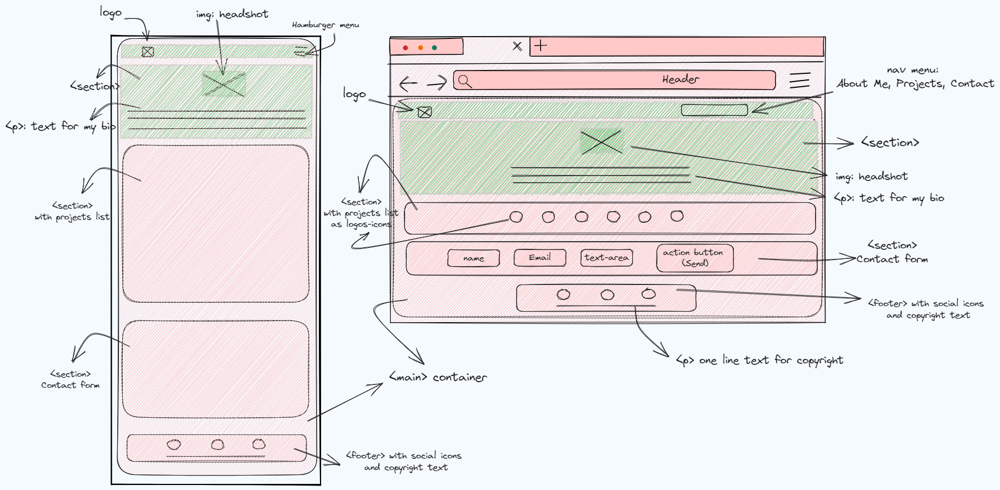
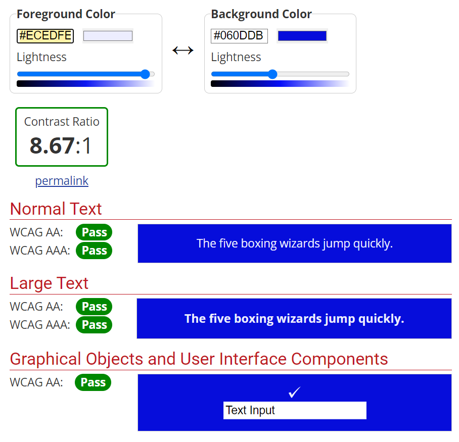
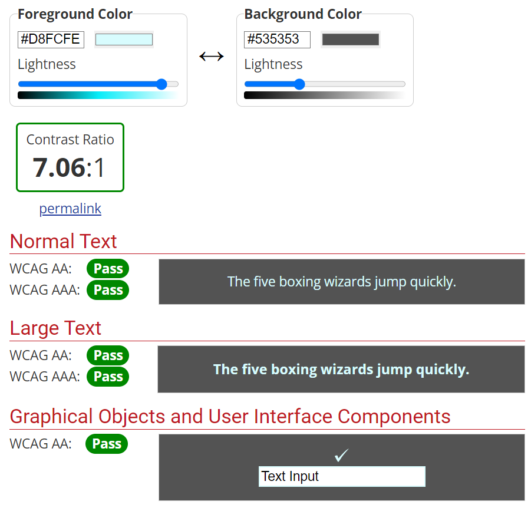
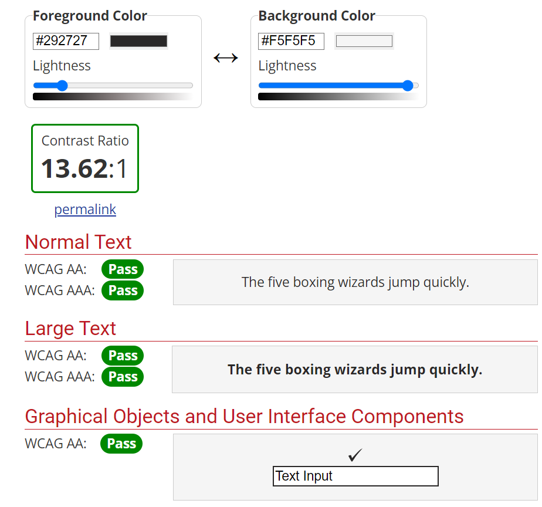

 # Roberta De Cecco - Portfolio Task
  My first project in HTML-CSS (v 1.0 - Oct2023) as part of the She Codes Australia Plus Program 2023/2024.
 
 # [My portfolio site](https://robyonej.github.io/index.html)

 # Resources:
 1. To check accessibility of chosen colors: https://webaim.org/resources/contrastchecker/
 2. To choose typography: https://fonts.google.com/
 3. To check semantic correctness: https://validator.w3.org/nu/#l62c37
 4. For sending email: https://formspree.io/
 5. For colors styleguide: https://codepen.io/Roberta-De-Cecco/pen/qBLLjQg?editors=1100

 # Wireframe: 
 

 # Accessibility:
 
 
 

 ## Project Requirements
 
 ### Content

 - [Y] At least one profile picture 
    - Headshot picture is static: https://robyonej.github.io/images/rdc.png 
 - [Y] Biography (at least 100 words)
    - Biography is just plain text with 'emphasis' for the h4 subtitle and some styling for the 'She Codes Plus' program reference.
 - [Y] Functional Contact Form
    - Contact Form has been setup with Formspree and, it successfully sends an email to my email address.
 - [Y] "Projects" section
    - Projects section shows a list of projects I will be working on during She Codes Plus and, each of them is a link, which redirects visitors to a second page https://robyonej.github.io/projects.html where, they will see a 'Coming Soon..' text along with the icons to the external sites and an hamburger menu to redirect them back to the Homepage or the other sections, on the homepage, they click on in the hamburger menu.
 - [Y] Links to external sites, e.g. GitHub and LinkedIn 
    - Links to external site are shown as icons at the footer of the page and their redirect visitors to my social platforms on a new tab - github.png and linkedin.png saved in: 'images' folder
 
 ### Technical

 - [Y] At least 2 web pages.
    - Each project links send visitor to a second page - https://robyonej.github.io/projects.html
 - [Y] Version controlled with Git.
    - Version controlled in 'develop' and 'main' branches: https://github.com/RobyOneJ/RobyOneJ.github.io/tree/develop; https://github.com/RobyOneJ/RobyOneJ.github.io/tree/main;
 - [Y] Deployed on GitHub pages.
    - My portfolio is deployed on GitHub pages: https://github.com/RobyOneJ/RobyOneJ.github.io
 - [Y] Implements responsive design principles.
    - My CSS contains media queries to make the webpages responsive when transictioning from Desktop to Mobile or Tablets devices. Text adjusts accordingly to the device used, header menu becomes an hamburger menu; sections align vertically but this is more visible in the Projects sections where the links, horizontally aligned in the desktop version, align vertically when in mobile or tablet mode.
 - [Y] Uses semantic HTML.
    - My HTML code contains th following semantic element: header,html,head,body,main,nav,section,footer;

 Checked my HTML code into: https://validator.w3.org/nu/#l62c37 and got this response: Document checking completed. No errors or warnings to show. See screenshot: https://robyonej.github.io/screenshots/Semantic_HTML_ValidatorResponse.png
 
 ### Bonus (optional)

 - [Y] Different styles for active, hover and focus states.
    - My CSS style uses :focus, :hover and :active. Eg: check line 70 of my CSS code: /* Default style for mouse pointer on the 'a' element*/
        - Hover - Visible in desktop view. When user hovers on top of the nav hyperlinks, they activate. See screenshot: https://robyonej.github.io/screenshots/Hovering_activating_element.png; https://robyonej.github.io/screenshots/Hovering_activating_hyperlink.png; https://robyonej.github.io/screenshots/Hovering_activating_logs.png;
        - Focus - on input fields of the contact form; from white background color to a light grey color when on it. See screenshot: https://robyonej.github.io/screenshots/Focus_on_field.png.
        - Active - when an element is clicked, text color changes to red. See videos below in the 'Features videos' section.

 - [N] Include JavaScript to add some dynamic elements to your site. (Extratricky!)
 
 ### Screenshots> Please include the following:
 For both points below, please check videos in my screenshots folder: 'Video1_Desktop_Tablet' views and 'Video2_Mobile view'.

#### Features videos

- [Desktop_Tablet view](./screenshots/Video1_Desktop_Tablet_view.mp4)
- [Mobile view](./screenshots/Video2_Mobile_view.mp4)
